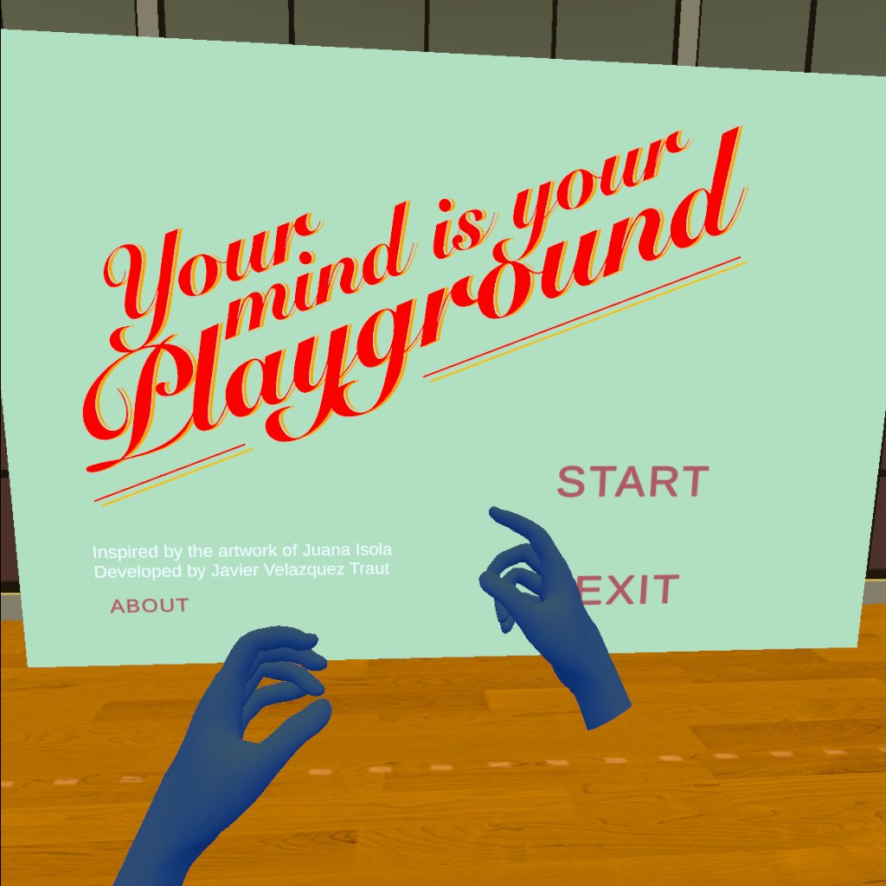
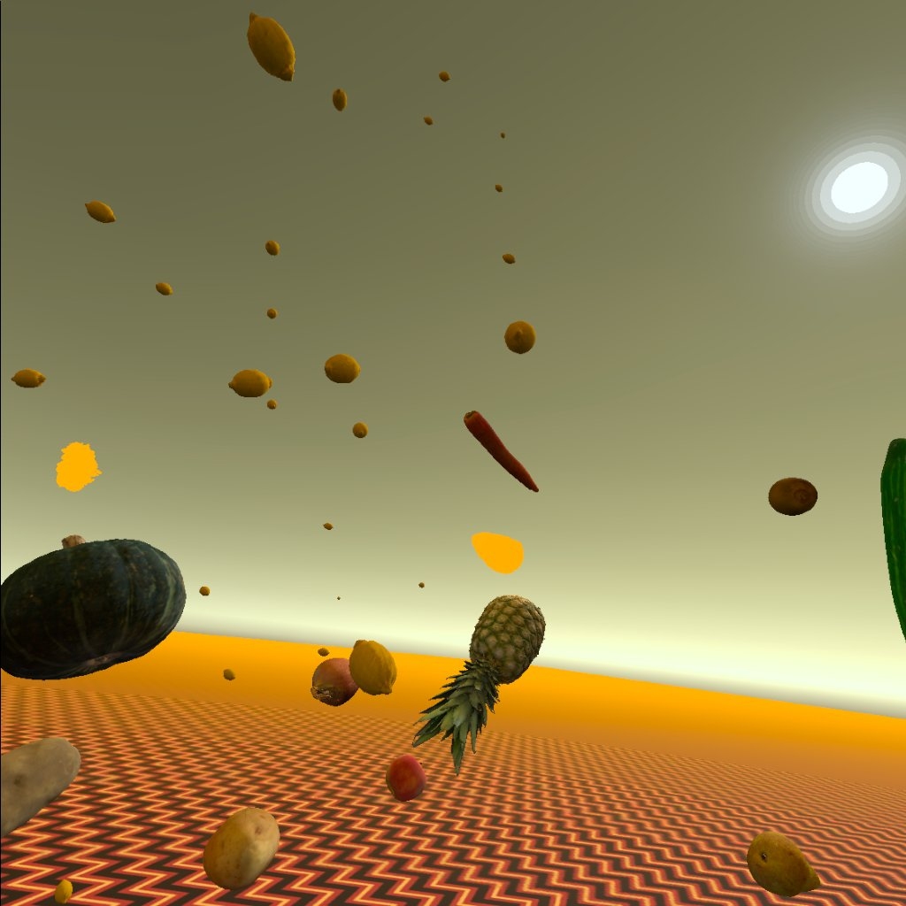
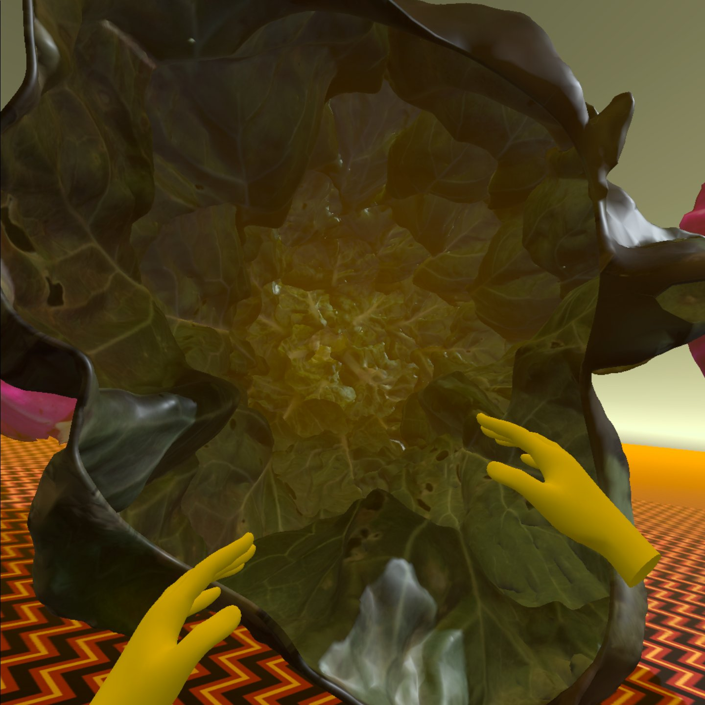

# Your Mind is Your Playground

**Virtual Reality experience designed and developed for the exhibition "Your Mind is Your Playground" based on the video/performance by [Juana Isola](https://www.instagram.com/juanaisola/).**

## Overview

This 5-minute surreal experience explores the idea of letting your mind wander when you are doing daily tasks such as cooking or cleaning. The experience features hand interaction and room size movement.

This piece came out mostly from experimentation trying out object dynamics and forms of interaction inside the 3D space. This was built using Unity which is super versatile for experimentation!

## Features

- Hand interaction
- Room size movement
- Surreal visual and interactive elements

## Platform

- Made for Oculus Quest headset
- Soon to be available in App Lab

## Credits

- 3D Models licensed under CC made by Lassi Kaukonen, Matousekfoto, Zacxophone, and Namahage. Downloaded from Sketchfab.

## Stills

Here are some stills of the end result:

## Installation

1. Clone the repository.
2. Open the project in Unity.
3. Build and run on Oculus Quest.